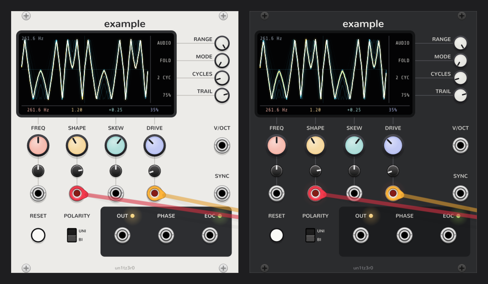

# VCV Rack 2 plugin template



A starting point for VCV Rack 2 plugins. It's a complete plugin that builds as is, with one example module that
shows the common panel idioms in working code, a cross-platform build using the Rack SDK, and CI that publishes a
release whenever you tag a new version.

## Make it yours

1. Fork this repository (or use it as a template) and clone it.
2. In `plugin.json`, set `slug`, `name`, `brand`, `author` and the URLs. The slug must be unique in the
   [VCV Library](https://library.vcvrack.com) and should never change once you've released.
3. Build and install it as below, then start changing the Example module or add your own (see
   [Adding a module](#adding-a-module)). Comments of the form `/* your ... here */` mark the extension points.

## Building

Install the toolchain for your platform as described in the
[plugin development tutorial](https://vcvrack.com/manual/PluginDevelopmentTutorial):

- **Linux:** `build-essential`, `jq`, `zstd`
- **macOS:** Xcode command line tools, plus `jq` and `zstd` from Homebrew
- **Windows:** [MSYS2](https://www.msys2.org), then in its MINGW64 shell
  `pacman -S make tar unzip zstd jq mingw-w64-x86_64-gcc`

Then download the [Rack SDK](https://vcvrack.com/downloads/) for your platform (`lin-x64`, `win-x64` or
`mac-x64+arm64`) and point `RACK_DIR` at it:

```sh
unzip Rack-SDK-2.6.6-lin-x64.zip
make RACK_DIR=Rack-SDK            # builds plugin.so / plugin.dylib / plugin.dll
make install RACK_DIR=Rack-SDK    # packages it and copies it into your Rack user folder
make dist RACK_DIR=Rack-SDK       # just the package: dist/<slug>-<version>-<platform>.vcvplugin
```

Restart Rack after `make install` to load the new build.

## Releasing

CI (`.github/workflows/build.yml`) builds Linux, Windows, macOS x64 and macOS arm64 packages on every push and pull
request, and keeps them as artifacts of the workflow run. To publish a release, bump `version` in `plugin.json`
(Rack 2 plugins are versioned `2.x.y`), commit, and push a matching tag:

```sh
git tag v2.0.1
git push origin v2.0.1
```

The release job checks that the tag matches `plugin.json`, then attaches all four packages to a GitHub release.
Linux builds run in an Ubuntu 20.04 container so the plugin also loads on older distributions. The SDK version is
set once, as `RACK_SDK_VERSION` at the top of the workflow.

## What's where

| Path | Contents |
| --- | --- |
| `plugin.json` | The manifest: plugin and module metadata, and the version. |
| `src/plugin.*` | The plugin's entry point, which registers each module's `Model`. |
| `src/Example.cpp` | The example module: DSP, screen graphics and panel widget. |
| `src/Screen.*` | A reusable display widget whose readouts line up with the controls around it. |
| `src/ui.hpp` | Panel layout lookup, plus the custom knobs and button. |
| `src/TripleBuffer.hpp` | Lock-free hand-off of data from the audio thread to the UI thread. |
| `res/` | Panels and component graphics, shipped with the plugin. Generated, so don't edit by hand. |
| `res-src/panel.py` | Generates everything in `res/`. |

## The Example module

A morphing oscillator with a built-in scope. Each part of it is there to demonstrate something:

| On the panel | Shows how to |
| --- | --- |
| FREQ, SHAPE, SKEW and DRIVE, each with an attenuverter and CV input | Build modulatable parameters (`modulated()`), and display and accept values in real units with `ParamQuantity` subclasses: FREQ shows and takes Hz. |
| The screen | Draw realtime graphics on layer 1, so they stay lit when the room lights are dimmed, fed from the audio thread through a `TripleBuffer`. Each knob's value is shown at the screen edge where the panel line from that knob meets it, in the knob's own colour. |
| RANGE, MODE, CYCLES and TRAIL beside the screen | Make knobs snap between named values (`configSwitch` on a knob), with their values on the screen like the soft keys of a digital scope. |
| V/OCT and SYNC | Handle polyphony, 1V/octave pitch and Schmitt-triggered sync. |
| RESET and POLARITY | Use a momentary push button and a toggle switch with named positions. |
| OUT, PHASE and EOC, with their lights | Output audio, CV and triggers (`PulseGenerator`), and drive single and bicolour lights at a reduced rate. |
| Right-click → Screen colour | Add context menu items, and save extra state with the patch (`dataToJson`). |
| Light and dark panels | Follow Rack's "prefer dark panels" setting with `createPanel(light, dark)` and themed screws. |

The waveform is computed naively, so it aliases at audio rates. Band-limit it (see `dsp::MinBlepGenerator`) or
oversample it before using it in earnest.

## Panels

`make panels` runs `res-src/panel.py`, which needs Python 3 and fontTools (`python3 -m pip install fonttools`). It
writes each module's light and dark panel, plus the custom knob and button graphics, into `res/`. Labels are
converted to paths, since Rack's SVG renderer ignores `<text>`.

Each panel also gets a hidden `components` layer that marks where every widget goes, using the SDK's `helper.py`
convention: a red circle for a param, green for an input, blue for an output, magenta for a light, and a yellow
rectangle for a custom widget. Each shape's id is the C++ enum name (`FREQ_PARAM`, `OUT_LIGHT`, `SCREEN_WIDGET`).
At runtime, `PanelLayout` reads those positions back, so the panel is the only place the layout is written down:

```cpp
addParam(createParamCentered<PastelKnob<Pastel::Salmon>>(AT(FREQ_PARAM)));
// AT(FREQ_PARAM) expands to: layout.center("FREQ_PARAM"), module, Example::FREQ_PARAM
```

To add a control, add a label and a `p.place('NAME_PARAM', x, y)` to the panel function in `panel.py`, run
`make panels`, and add one line like the one above. Moving a control needs no C++ change at all. Knob colours come
from `PASTELS` in `panel.py`, and a knob's screen readout picks up its colour automatically.

If you'd rather draw panels in Inkscape, edit the SVGs in `res/` directly and stop running the generator. Keep the
`components` layer and convert text to paths (Path → Object to Path).

## Adding a module

1. Copy `src/Example.cpp` to `src/MyModule.cpp` and rename `Example` to `MyModule` throughout.
2. Declare `extern Model* modelMyModule;` in `src/plugin.hpp`, call `p->addModel(modelMyModule);` in
   `src/plugin.cpp`, and add an entry with the slug `MyModule` to `modules` in `plugin.json`.
3. Write a panel function in `res-src/panel.py`, add it to `PANELS` under the slug `MyModule`, and run
   `make panels` to get `res/MyModule.svg` and `res/MyModule-dark.svg`.

## License

MIT, see [LICENSE](LICENSE). The Nunito font in `res-src/fonts` (SIL Open Font License) is used only to generate
panel artwork and isn't shipped with the plugin.
